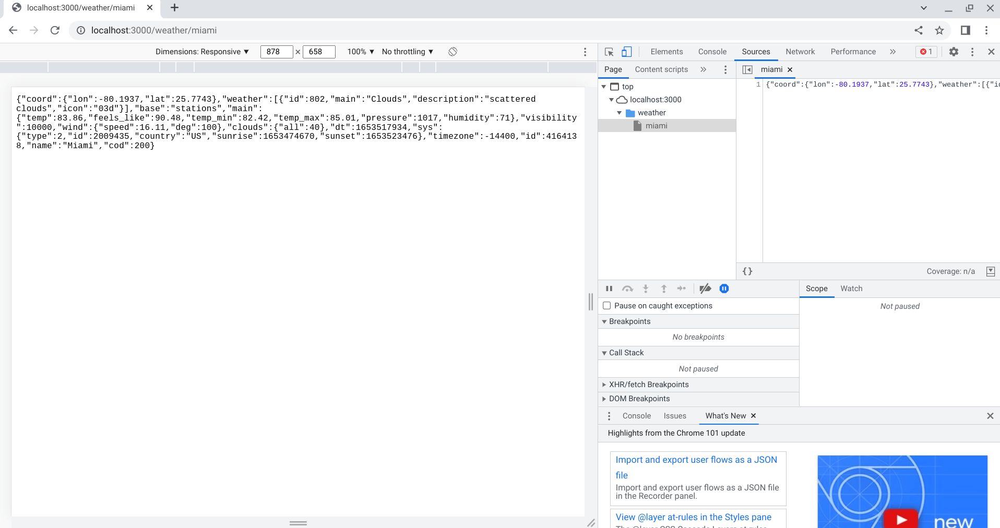

# Node Api Key Relay

## Overview

## Table of contents

- [Overview](#overview)
  - [Screenshot](#screenshot)
  - [Built With](#built-with)
- [Useful Resources](#useful-resources)

## Overview

This is the completed result from this [tutorial](https://www.youtube.com/watch?v=uk9pviyvrtg).  The other [tutorial](https://github.com/jdegand/node-api-proxy-server) I followed was derived from this. 

### Screenshot

### Built with

- express
- express-rate-limit
- node-fetch

## Useful Resources

- [Stack Overflow](https://stackoverflow.com/questions/69041454/error-require-of-es-modules-is-not-supported-when-importing-node-fetch) - have to use version 2 of node-fetch if using common js
